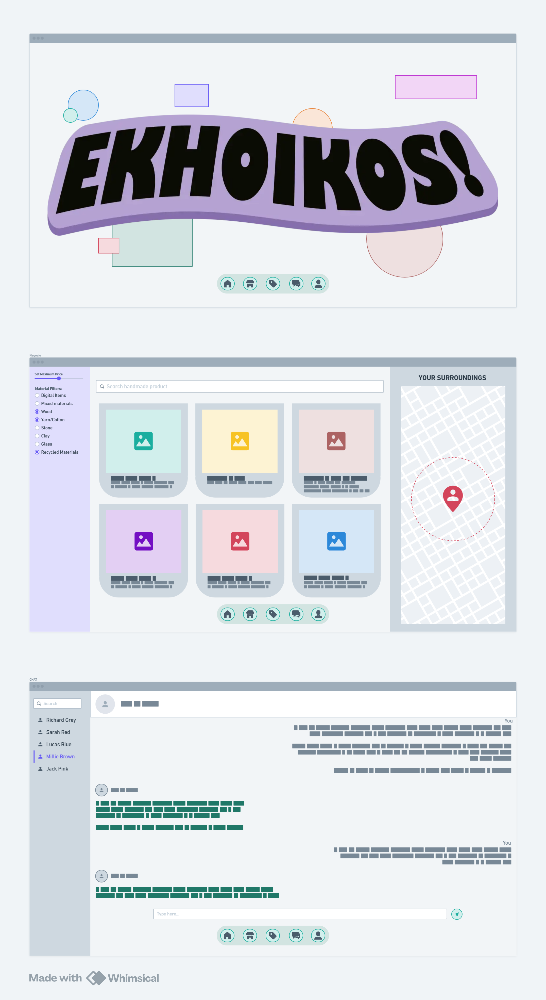
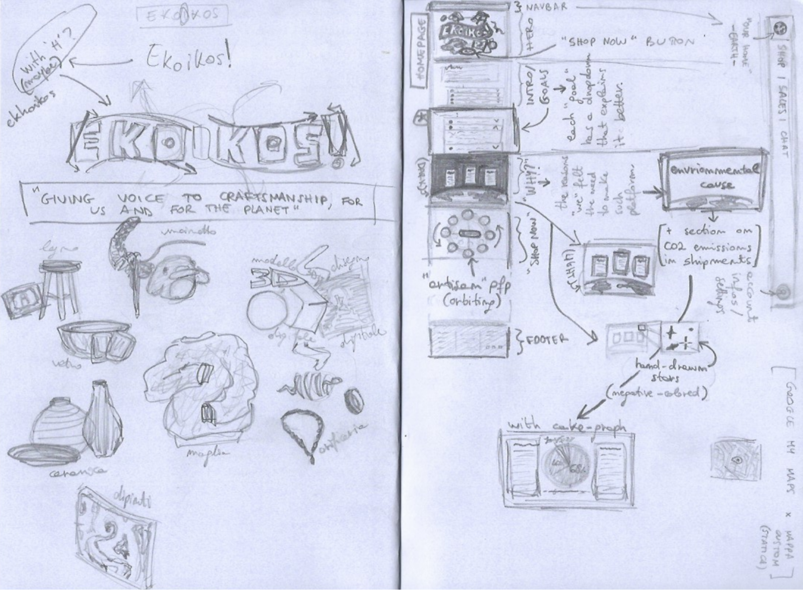

### **_Vezzola Luca - 5CI - anno scolastico 2025/26_**

# **LABORATORIO DI INFORMATICA**

#### 16 settembre 2025

### Nome Software House:

Primrose _(primrose (inglese) -> primula)_.

### Nome Piattaforma:

Ekhoikos _(ekho (greco) -> rumore; oikos (latino) -> casa, ambiente)_.

### Descrizione del progetto:

- Sistema di compravendita online di beni fisici e digitali fatti a mano, per promuovere i liberi professionisti ed il self-made.
- Sulla piattaforma si promuove un'economia a km zero, basando la ricerca sulla distanza minima tra cliente-"artigiano" e la sostenibilità dei materiali utilizzati.
- Gli obbiettivi della piattaforma sono i seguenti:
  - Creare un ecosistema di e-commerce per prodotti creati e lavorati a mano, sia fisici che digitali
  - Per limitare i consumi e le emissioni, la ricerca dei prodotti punta a mostrare gli "artigiani" più vicini, promuovendo così anche la cultura locale.
  - Per favorire l'utilizzo di materiali ecosostenibili nei prodotti fisici esiste un sistema di classifica basata sulle recensioni degli acquirenti.
  - Per ogni vendita, il 5% del ricavato viene donato ad una o più associazioni scelte dall'acquirente al momento dell'acquisto.

### Definizione del target

Ekhoikos è stato pensato per chiunque abbia interesse ad acquistare prodotti ecosostenibili e soprattutto locali, a sostenere gli artisti e la cultura locali.

Gli utilizzatori saranno persone dai 18 ai 50 anni.

Esempio di target:

- Personas ==> Roberta
- Target ==> Cittadina Ecologista
- Caratteristiche ==> E' una signora di 47 anni con una passione per le decorazioni in legno intagliato.

---

#### 23 settembre 2025

### Mockup progetto (fatto con [Whimsical](https://whimsical.com/)):



### Consigli della prof:

- Aggiungere una pagina di sensibilizzazione sulle emissioni di CO2 dovute ai trasporti e le enormi distanze che questi percorrono prima di arrivare a noi.

---

#### 28 settembre 2025

### Mockup Homepage:



---

#### 30 settembre 2025

### Studio per l'implementazione di React:

Apprendimento in autonomia della libreria JavaScript React, assieme a Vite - un server di sviluppo back-end locale -, e Bootstrap - un\* libreria/framework/toolkit (non si sanno definire nemmeno loro) - per sviluppare meglio, e più velocemente, il front-end.

#### Sitografia:

- [video-spiegazione: introduzione a React](https://youtu.be/SqcY0GlETPk?si=3CgvXV8WVLR5Bxap)
- [video-spiegazione: modificare i colori di Bootstrap](https://www.youtube.com/watch?v=au5ccstcbnc)

### Nota:

## Non utilizzerò Bootstrap. E' troppo rigido per ciò che voglio creare. Piuttosto scrivo il CSS manualmente per avere più libertà nello stile e nella forma.

---

#### 2 Ottobre 2025

### Creazione di una sezione riservata ad educazione civica nell'index del sito

Creazione di una sezione nella parte finale dell'index seguendo i [consigli dati dalla prof](#consigli-della-prof).

---

#### 19 Ottobre 2025

### Inizio implementazione in React

Implementazione in React dei component base (App, Navbar, Home); esplorato React Bits e trovato due elementi interessanti:

- [sfondo-prisma](https://reactbits.dev/backgrounds/prism)
- [navbar-dock](https://reactbits.dev/components/dock)

#### Sitografia:

- [album-spiegazione: introduzione a React](https://www.youtube.com/playlist?list=PL4cUxeGkcC9gZD-Tvwfod2gaISzfRiP9d)

---

#### 31 Ottobre 2025

### Continuazione implementazione in React

Implementazione in React del Dock (in sostituzione alla navbar) e trasposizione della home

#### Sitografia:

- [icone per react (già incluse)](https://react-icons.github.io/react-icons/)

---

#### 24 Novembre 2025

### Esercizi in JavaScript

Creare le funzioni lambda, con i commenti:

1. somma, riceve un array e restituisce la somma degli elementi
2. concatena, riceve un array di stringhe e le concatena
3. cerca, riceve una stringa e dice se sono presenti caratteri non dell'alfabeto
4. fattoriale

#### Esercizio svolto:

```js
// Somma, riceve un array e restituisce la somma degli elementi
const somma = (a, b) => a + b;

// Concatena, riceve un array di stringhe e le concatena
const concatena = (strArr) => strArr.reduce((totale, el) => totale + el);

// Cerca, riceve una stringa e dice se sono presenti caratteri non dell'alfabeto
const cerca = (str) => (/[^a-z|A-Z]/.test(str) ? "si" : "no");

// Fattoriale
const fattoriale = (n) => {
  let fact = 2;
  while (n > 2) fact *= n--;
  return fact;
};

function main(a, b, strArr, str, n) {
  // Ho utilizzato i "Template literals" per poter scrivere codice nella stringa
  // I Template literals sono delimitati da backtick (`) e il codice è incapsulato con "${,...}"

  console.log(`Somma di ${a} e ${b}: ${somma(a, b)}`);

  console.log(`Concatenatura di ${strArr}: ${concatena(strArr)}`);

  console.log(`Trovato un carattere non-lettera in ${str}: ${cerca(str)}`);

  console.log(`Fattoriale di ${n}: ${fattoriale(n)}`);
}
```

#### Screenshot funzionamento:


#### Sitografia:

- [metodi degli array (per il metodo reduce)](https://www.w3schools.com/jsref/jsref_array[].asp)
- [metodi delle RegExp (per il metodo test)](https://www.w3schools.com/js/js_regexp.asp)

---

#### 27 Novembre 2025

### Creazione pagina di login

Ho creato la pagina di login e ho raffinato la grafica e anche riorganizzato la struttura dei file, in particolre dei file css.

Parte del codice html dell'index:

```html
[...]

<body>
  <!-- Navbar -->
  <nav>
    <ul>
      <li><a href="index.html" class="active">Home</a></li>
      <li><a href="shop.html">Shop</a></li>
      <li><a href="sales.html">Sales</a></li>
      <li><a href="chat.html">Chat</a></li>
      <li style="float: right"><a href="login.html">Login</a></li>
    </ul>
  </nav>

  <main>
    <!-- Logo -->
    <section id="logo" class="covering-section center-x center-y">
      
      <a href="./shop.html">
        <button class="big-button rounded-corners">Shop Now!</button>
      </a>
      <p style="text-align: center; color: var(--info);">
        scopri cos'è Ekhoikos<br />|<br />|<br />v
      </p>
    </section>
  </main>
</body>

[...]
```

### Creazione pagina dello shop

Ho creato la pagina dello shop con le card per i prodotti, una lista di filtri e una sezione per mettere in seguito la mappa.

Parte del codice html del login:

```html
[...]

<form action="link.xyz" class="padding rounded-corners">
  <h1>Registrati</h1>
  <div class="form-fields">
    <label for="name">Nome:</label>
    <input type="name" id="name" name="name" />

    <label for="surname">Cognome:</label>
    <input type="surname" id="surname" name="surname" />

    <label for="username">Username:</label>
    <input type="text" id="username" name="username" />

    <label for="password">Password:</label>
    <input type="password" id="password" name="password" />

    <label for="passwordConfirm">Conferma password:</label>
    <input type="password" id="passwordConfirm" name="passwordConfirm" />
  </div>
  <input type="submit" id="form_submit" name="Login" />
</form>

[...]
```

---

#### 5 Dicembre 2025

### Modellazione database

Ho modellato il DB del sito web su carta e l'ho consegnato.

---

#### 19/12/2025

### Creazione delle tabelle Utenti e Products

```sql
CREATE TABLE Users (
    User_ID int PRIMARY KEY AUTO_INCREMENT,
    Name varchar(64) NOT NULL,
    Surname varchar(64) NOT NULL,
    Username varchar(15) NOT NULL,
    Psw varchar(64) NOT NULL
);
CREATE TABLE Products (
    Creator_ID int,
    Name varchar(64) NOT NULL,
	  Description varchar(2048) NOT NULL,
    FOREIGN KEY (Creator_ID) REFERENCES Users(User_ID)
);
```

### Inserimento dei dati di prova

```sql
INSERT INTO users (Name, Surname, Username, Psw)
VALUES ("Mario", "Rossi", "Mrss_81", "passwordDifficilissima99"),
	("Alessia", "Verdi", "AVrd", "passwordDifficilissimissima101"),
    ("Baryon", "Moss", "Bjoiash", "ciao:)")
;

INSERT INTO products (Name, Description, Creator_ID) VALUES ("Foca Peluche", "Una carinissima e morbidissima foca peluche fatta interamente a mano per addormentarsi all'istante!", 1), ("Cornice A5 in larice decorata", "Cornice per immagini formato A5 in larice decorata con conchiglie marine.", 1), ("Sassi", "Ho raccolto dei sassi colorati. Vuoi comprarli? Sono a tua disposione.", 2);
```

### Query esempio

```sql
SELECT * FROM products WHERE Creator_ID = 1;
```

---

#### 23/01/2026

## Primi passi con PHP: inizializzazione di un DB e comandi di base in PHP

Cartella contenente i file del DB creato con xampp lite: `xampp-lite/apps/mysql/data/nomeDatabase`

### Creazione del database e della tabella utenti

```sql
create database Ekhoikos;

create table Users(
  user_code int AUTO_INCREMENT PRIMARY KEY,
  name varchar(50) not null,
  surname varchar(50) not null,
  email varchar(254) not null
);
```

### Inserimento dei dati di prova

```sql
insert into users(name, surname, email) VALUES
(
  "Mario", "Rosi", "mross@gmail.com"
),
(
  "Anna", "Verdi", "averd@gmail.com"
),
(
  "Maria", "Azzurri", "mazz@gmail.com"
);
```

### File PHP per una scmplice INSERT

[Source...](https://www.w3schools.com/php/php_mysql_insert.asp)

I file php devono essere inseriti dentro la cartella `www/myDB`

```php
  <?php
  // Dati fondamentali per la connessione al server DB
  $servername = "localhost"; // localhost per usare un server DB locale
  $username = "root"; // root because this is the "master user"
  $password = ""; // for now, no password is needed
  $dbname = "myDB";

  // Create connection
$conn = new mysqli($servername, $username, $password, $dbname);
//Check connection
if ($conn->query($sql) === TRUE) {
  echo "New record created successfully";
} else {
  echo "Error: " . $sql . "<br>" . $conn->eror;
}

$conn->close();

  ?>
```

### Passare i dati da una pagina HTML ad uno script PHP

```html
<!DOCTYPE html>
<html>
  <head>
    <title>Insert user</title>
  </head>
  <body>
    <!-- 'action' should contain the name of the php file that handles this form -->
    <form action="fileName.php" method="post">
      <label for="uname">Name:</label>
      <input type="text" id="uname" name="uname" />

      <label for="usurname">Surname:</label>
      <input type="text" id="usurname" name="usurname" />

      <label for="uemail">Email:</label>
      <input type="text" id="uemail" name="uemail" />

      <input type="submit" value="Insert User" />
    </form>
  </body>
</html>
```

---

#### 30/01/2026

## Esercitazione in laboratorio: creazione DB, popolamento e costruzione di query

```sql
create database Negozio;

create table categorie(
  id_categoria int AUTO_INCREMENT PRIMARY KEY,
  nome varchar(128) NOT null
);
CREATE table prodotti(
  id_prodotto int AUTO_INCREMENT PRIMARY KEY,
  nome varchar(128) NOT NULL,
  fornitore varchar(128) not null,
  id_categorie int,
  FOREIGN KEY (id_categorie) REFERENCES categorie(id_categoria),
  prezzo float not null
);
create table clienti(
  id_cliente int AUTO_INCREMENT PRIMARY KEY,
  nome varchar(128) not null,
  indirizzo varchar(256) not null,
  citta varchar(256) not null,
  nazione varchar(32) not null
);
create table ordini(
  id_ordine int AUTO_INCREMENT PRIMARY KEY,
  id_cliente int NOT NULL,
  FOREIGN KEY (id_cliente) REFERENCES clienti(id_cliente),
  data_ordine date not null
);
create table dettagli_ordini(
  id_ordine int,
  id_prodotto int,
  FOREIGN KEY (id_ordine) REFERENCES ordini(id_ordine),
  FOREIGN KEY (id_prodotto) REFERENCES prodotti(id_prodotto),
  quantità int not null,
  PRIMARY KEY (id_ordine, id_prodotto)
);
```

---

#### 6/02/2026

## Creazione file HTML e PHP di un form

Form di input e php

Prendere le pagine registrazione.html e registrazione.php, utilizzare il db negozio implementato e popolato la scorsa lezione, o uno simile, modificare tenendo conto di:

- Handling
- Validation
- Required
- Form url e-mail

Creare il file connessione.php, il file funzioni.php contenente la funzione test_input
Modificare il file registrazione.html e registrazione.php utilizzando prepared statements.
Consegnare il diario di bordo aggiornato e la cartella sito_cognome contenuta nella cartella www

Link utili:

- https://www.w3schools.com/html/html_form_input_types.asp
- https://www.w3schools.com/php/php_forms.asp
- https://www.w3schools.com/php/php_mysql_prepared_statements.asp

---

#### 1/03/2026

## Creazione di un sistema di Handling, Validation, Requirement, e Input Validation

Sistema di gestione form con validazione e connessione al database (con XAMPP).

## Componenti Principali

- `connessione.php` - Gestisce la connessione al database
```php
<?php
  // Inizializzazione delle variabili descrittive della connessione con il DB
  $servername = "localhost";
  $username = "root";
  $password = "";
  $dbname = "negozio";

  // Create connection
  $conn = new mysqli($servername, $username, $password, $dbname);
  // Check connection
  if ($conn->connect_error) {
      die("Connection failed: " . $conn->connect_error);
  }

  $sql = "INSERT INTO Clienti (nome, indirizzo, citta, nazione)
  VALUES ('$unameAndSurname', '$uaddress', '$ucity', '$unation')";

  if ($conn->query($sql) === TRUE) {
    echo "<span class='success'>New client added successfully!</span>";
  } else {
  echo "Error: " . $sql . "<br>" . $conn->eror;
  }

  $conn->close();
?>
```
- `functions.php` - Contiene la funzione per correggere l'input in un formato ideale:
```php
<?php
function test_input($data) {
  $data = trim($data);
  $data = stripslashes($data);
  $data = htmlspecialchars($data);
  return $data;
}
?>
```
## Caratteristiche di Sicurezza

- Utilizza prepared statements per proteggere da SQL injection
- Valida tutti i dati ricevuti dal form

## Aggiunta di una lista di opzioni (select with options) all'HTML con JS

```js
const nationSelect = document.getElementById("nationSelect");

const nationsList = [
  "Afghanistan",
  "Albania",
  ...
  "Zimbabwe",
];

let node;
let textnode;

node = document.createElement("option");
textnode = document.createTextNode("-----");
node.appendChild(textnode);
node.setAttribute("value", ""); // "value" è nullo per l'opzione vuota
nationSelect.appendChild(node);

// Aggiunge un'opzione per ogni nazione nella lista con attributo "value" identico al nome dell'opzione
nationsList.forEach((el) => {
  node = document.createElement("option");

  textnode = document.createTextNode(el);
  node.appendChild(textnode);

  node.setAttribute("value", el);

  nationSelect.appendChild(node);
});

```

---

#### 11/03/2026

## SQL Select via PHP

Esercizi su select via script PHP server-side (con XAMPP).

## Select create

- `selectAll.php`
  ```php
  <?php
  // Reference: https://www.w3schools.com/php/php_mysql_select.asp

  $servername = "localhost";
  $username = "root";
  $password = "";
  $dbname = "negozio";

  // Create connection
  $conn = new mysqli($servername, $username, $password, $dbname);
  // Check connection
  if ($conn->connect_error) {
    die("Connection failed: " . $conn->connect_error);
  }

  $sql = "SELECT * from Clienti";
  // Execute the SQL query
  $result = $conn->query($sql);

  // Output a title
  echo "<h1>Query: SELECT * from Clienti</h1>";

  // Process the result set
  if ($result->num_rows > 0) {
    // Output data of each row
    while($row = $result->fetch_assoc()) {
      echo "<b>id:</b> " . $row["id_cliente"].
      "; <b>nome:</b> " . $row["nome"].
      "; <b>indirizzo:</b> " . $row["indirizzo"].
      "; <b>città:</b> " . $row["citta"].
      "; <b>nazione:</b> " . $row["nazione"].
      "<br>";
    }
  } else {
    echo "0 results";
  }

  $conn->close();
  ?>
  ```
  Risultato:
  

- `selectWhere.php`
  ```php
  <?php
  // Reference: https://www.w3schools.com/php/php_mysql_select.asp

  $servername = "localhost";
  $username = "root";
  $password = "";
  $dbname = "negozio";

  // Create connection
  $conn = new mysqli($servername, $username, $password, $dbname);
  // Check connection
  if ($conn->connect_error) {
    die("Connection failed: " . $conn->connect_error);
  }

  $sql = "SELECT id_cliente, nome from Clienti where nazione != 'Italia'";
  // Execute the SQL query
  $result = $conn->query($sql);

  // Output a title
  echo "<h1>Query: SELECT id_cliente, nome from Clienti where nazione != 'Italia'</h1>";

  // Process the result set
  if ($result->num_rows > 0) {
    // Output data of each row
    while($row = $result->fetch_assoc()) {
      echo "<b>id:</b> " . $row["id_cliente"].
      "; <b>nome:</b> " . $row["nome"].
      "<br>";
    }
  } else {
    echo "0 results";
  }

  $conn->close();
  ?>
  ```
  Risultato:
  

- `selectJoin.php`
  ```php
  <?php
  // Reference: https://www.w3schools.com/php/php_mysql_select.asp

  $servername = "localhost";
  $username = "root";
  $password = "";
  $dbname = "negozio";

  // Create connection
  $conn = new mysqli($servername, $username, $password, $dbname);
  // Check connection
  if ($conn->connect_error) {
    die("Connection failed: " . $conn->connect_error);
  }

  $sql = "SELECT P.id_prodotto, P.nome  from Prodotti AS P JOIN Categorie AS C on P.id_categorie = C.id_categoria WHERE C.nome = 'Libri e Riviste'";
  // Execute the SQL query
  $result = $conn->query($sql);

  // Output a title
  echo "<h1>Query: SELECT P.id_prodotto, P.nome  from Prodotti AS P JOIN Categorie AS C on P.id_categorie = C.id_categoria WHERE C.nome = 'Libri e Riviste'</h1>";

  // Process the result set
  if ($result->num_rows > 0) {
    // Output data of each row
    while($row = $result->fetch_assoc()) {
      echo "<b>id:</b> " . $row["id_prodotto"].
      "; <b>nome:</b> " . $row["nome"].
      "<br>";
    }
  } else {
    echo "0 results";
  }

  $conn->close();
  ?>
  ```
  Risultato:
  

---

#### 13/03/2026

## Creazione DB per progetto sito "Ekhoikos"

Creazione del database e delle tabelle con SQL.

## Creazione DB
```sql
CREATE DATABASE Ekhoikos;
```

## Creazione tabelle
```sql
CREATE TABLE Utenti(
  nomeUtente varchar(32) PRIMARY KEY,
  psw varchar(255) NOT NULL,
  nome varchar(64) NOT NULL,
  cognome varchar(64) NOT NULL,
  dNascita date NOT NULL,
  email varchar(320) NOT NULL UNIQUE
);

CREATE TABLE SpaziDiMemoria(
  idSpazio int PRIMARY KEY AUTO_INCREMENT,
  tier int(1)
);

CREATE TABLE Licenze(
  nome varchar(32) PRIMARY KEY,
  descrizione varchar(1024)
);

CREATE TABLE Venditori(
  nomeUtente varchar(32),
  stelle int(1),
  FOREIGN KEY (nomeUtente) REFERENCES Utenti(nomeUtente),
  PRIMARY KEY (nomeUtente)
);

CREATE TABLE File(
  idFIle int AUTO_INCREMENT,
  idSpazio int,
  nome varchar(255),
  filePath varchar(260),
  dimensioneByte int NOT NULL,
  unicoYN boolean NOT NULL,
  FOREIGN KEY (idSpazio) REFERENCES SpaziDiMemoria(idSpazio),
  PRIMARY KEY (idFile, idSpazio)
);

CREATE TABLE Prodotti(
  idProd int AUTO_INCREMENT,
  nomeVenditore varchar(32),
  statoProd varchar(32) NOT NULL,
  descrizione varchar(512),
  nome varchar(32) NOT NULL,
  prezzo decimal(10, 2) NOT NULL,
  quantita int,
  acconto decimal(10, 2),
  FOREIGN KEY (nomeVenditore) REFERENCES Venditori(nomeVenditore),
  PRIMARY KEY (idProd, nomeVenditore)
);

CREATE TABLE ProdottiVenduti(
  idProd int,
  nomeVenditore varchar(32),
  nomeCliente varchar(32),
  FOREIGN KEY (idProd, nomeVenditore) REFERENCES Prodotti(idProd, nomeVenditore),
  FOREIGN KEY (nomeCliente) REFERENCES Utenti(nomeUtente)
);

CREATE TABLE Richieste(
  idRichiesta int AUTO_INCREMENT,
  nomeCliente varchar(32),
  idProd int,
  nomeVenditore varchar(32),
  statoRichiesta varchar(32) DEFAULT "In attesa",
  specificazioni varchar(512),
  FOREIGN KEY (nomeCliente) REFERENCES Utenti(nomeUtente),
  FOREIGN KEY (idProd, nomeVenditore) REFERENCES Prodotti(idProd, nomeVenditore),
  PRIMARY KEY (idRichiesta, nomeCliente, idProd, nomeVenditore)
);

CREATE TABLE ProdottiFisici(
  idProd int,
  nomeVenditore varchar(32),
  pesoKg decimal(3,2),
  FOREIGN KEY (idProd, nomeVenditore),
  PRIMARY KEY (idProd, nomeVenditore) REFERENCES Prodotti(idProd, nomeVenditore)
);

CREATE TABLE ProdottiDigitali(
  idProd int,
  nomeVenditore varchar(32),
  FOREIGN KEY (idProd, nomeVenditore) REFERENCES (idProd, nomeVenditore),
  PRIMARY KEY (idProd, nomeVenditore)
);

CREATE TABLE FileInProdottiDigitali(
  nome varchar(255),
  filePath varchar(260),
  idSpazio int,
  idProd int,
  nomeVenditore varchar(32),
  FOREIGN KEY (nome, filePath, idSpazio) REFERENCES File(nome, filePath, idSpazio),
  FOREIGN KEY (idProd, nomeVenditore) REFERENCES ProdottiDigitali(idProd, nomeVenditore),
  PRIMARY KEY (nome, filePath, idSpazio),
  PRIMARY KEY (idProd, nomeVenditore)
);
```

### Nota:

All'inserimento dei dati, le password sono crittate dal PHP nella seguente maniera:
```php
$password = "user_secret_password";
$hash = password_hash($password, PASSWORD_DEFAULT);

// Save $hash to your database. 
// Use a VARCHAR(255) column to allow for future algorithm changes.
```

Verifica degli utenti:
```php
$user_input = $_POST['password']; // Password from login form
$stored_hash = "..."; // Hash retrieved from your database

if (password_verify($user_input, $stored_hash)) {
    echo "Password is valid!";
} else {
    echo "Invalid password.";
}
```
