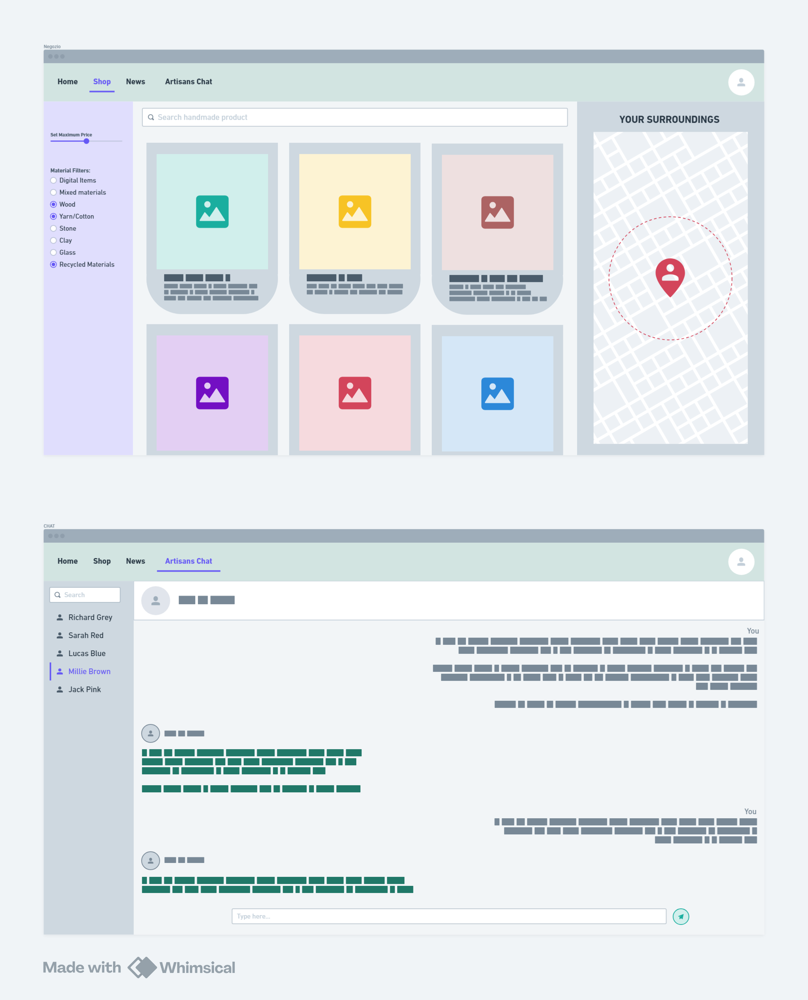

### ***Vezzola Luca - 5CI - anno scolastico 2025/26*** 

# **LABORATORIO DI INFORMATICA**

#### 16 settembre 2025

### Nome Software House:
Primrose _(primrose (inglese) -> primula)_.
### Nome Piattaforma:
Ekhoikos _(ekho (greco) -> rumore; oikos (latino) -> casa, ambiente)_.

### Descrizione del progetto:
- Sistema di compravendita online di beni fisici e digitali fatti a mano, per promuovere i liberi professionisti ed il self-made.
-  
- Gli obbiettivi della piattaforma sono i seguenti:
    - Creare un ecosistema di e-commerce per prodotti creati e lavorati a mano, sia fisici che digitali
    - Per limitare i consumi e le emissioni, la ricerca dei prodotti punta a mostrare gli "artigiani" più vicini, promuovendo così anche la cultura locale.
    - Per favorire l'utilizzo di materiali ecosostenibili nei prodotti fisici esiste un sistema di classifica basata sulle recensioni degli acquirenti.
    - Per ogni vendita, il 5% del ricavato viene donato ad una o più associazioni scelte dall'acquirente al momento dell'acquisto.

------------------------------------------------------------------------------------------------------------------

#### 23 settembre 2025

### Mockup progetto (fatto con [Whimsical](https://whimsical.com/)):

### Consigli della prof:
- Aggiungere una pagina di sensibilizzazione sulle emissioni di CO2 dovute ai trasporti e le enormi distanze che questi percorrono prima di arrivare nei nostri supermercati.