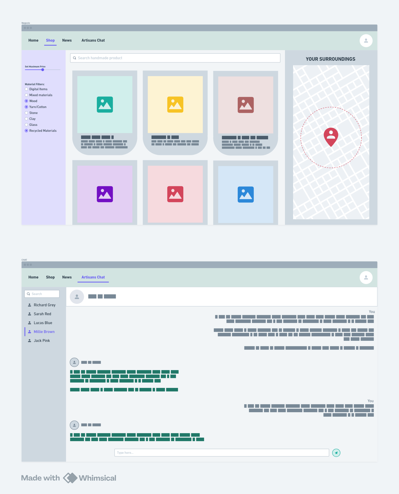

### **_Vezzola Luca - 5CI - anno scolastico 2025/26_**

# **LABORATORIO DI INFORMATICA**

#### 16 settembre 2025

### Nome Software House:

Primrose _(primrose (inglese) -> primula)_.

### Nome Piattaforma:

Ekhoikos _(ekho (greco) -> rumore; oikos (latino) -> casa, ambiente)_.

### Descrizione del progetto:

- Sistema di compravendita online di beni fisici e digitali fatti a mano, per promuovere i liberi professionisti ed il self-made.
- Sulla piattaforma si promuove un'economia a km zero, basando la ricerca sulla distanza minima tra cliente-"artigiano" e la sostenibilità dei materiali utilizzati.
- Gli obbiettivi della piattaforma sono i seguenti:
  - Creare un ecosistema di e-commerce per prodotti creati e lavorati a mano, sia fisici che digitali
  - Per limitare i consumi e le emissioni, la ricerca dei prodotti punta a mostrare gli "artigiani" più vicini, promuovendo così anche la cultura locale.
  - Per favorire l'utilizzo di materiali ecosostenibili nei prodotti fisici esiste un sistema di classifica basata sulle recensioni degli acquirenti.
  - Per ogni vendita, il 5% del ricavato viene donato ad una o più associazioni scelte dall'acquirente al momento dell'acquisto.

---

#### 23 settembre 2025

### Mockup progetto (fatto con [Whimsical](https://whimsical.com/)):

### Consigli della prof:

- Aggiungere una pagina di sensibilizzazione sulle emissioni di CO2 dovute ai trasporti e le enormi distanze che questi percorrono prima di arrivare nei nostri supermercati.

---

#### 28 settembre 2025

### Mockup Homepage:

---

#### 30 settembre 2025

### Studio per l'implementazione di React:

Apprendimento in autonomia della libreria JavaScript React, assieme a Vite - un server di sviluppo back-end locale -, e Bootstrap - un\* libreria/framework/toolkit (non si sanno definire nemmeno loro) - per sviluppare meglio, e più velocemente, il front-end.

#### Sitografia:

- [video-spiegazione: introduzione a React](https://youtu.be/SqcY0GlETPk?si=3CgvXV8WVLR5Bxap)
- [video-spiegazione: modificare i colori di Bootstrap](https://www.youtube.com/watch?v=au5ccstcbnc)

### Nota:

Non utilizzerò Bootstrap. E' troppo rigido per ciò che voglio creare. Piuttosto scrivo il CSS manualmente per avere più libertà nello stile e nella forma.
