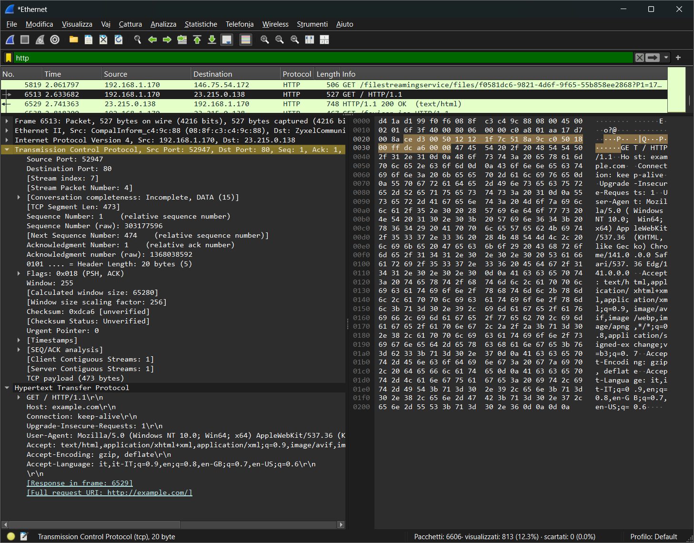
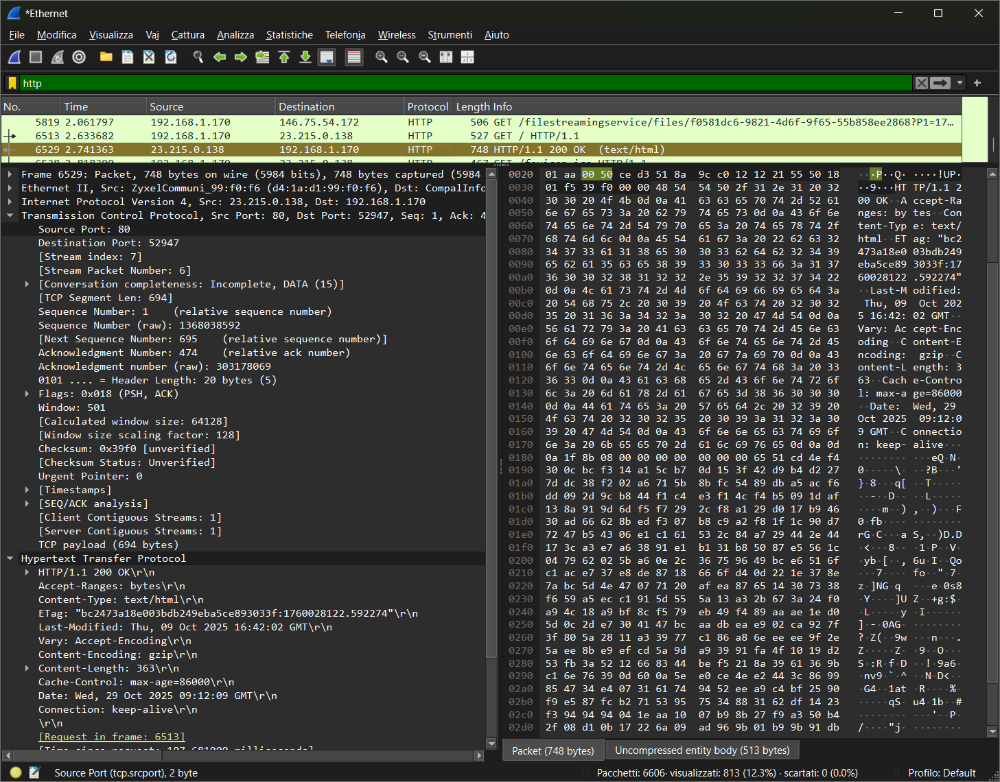

# Analisi di un messaggio HTTP con Wireshark

## Analisi delle PDU con Wireshark

1. Aprire Wireshark, selezionare la scheda Ethernet del dispositivo e impostare come filtro "http";
2. Aprire un browser qualsiasi al link "http://example.com/";
3. Ora su wireshark appariranno le PDU scambiate tra la macchina e il server:

   - 
   - 

4. Copiare il contenuto html del pacchetto contenente la risposta HTTP "(text/html)" nelle info.

### Contenuto HTML del messaggio HTTP in arrivo dal server

```html
<!doctype html>
<html lang="en">
    <head>
        <title>Example Domain</title>
        <meta name="viewport" content="width=device-width, initial-scale=1">
        <style>
          body{
            background:#eee;
            width:60vw;
            margin:15vh auto;
            font-family:system-ui,sans-serif
          }
          h1{font-size:1.5em}
          div{opacity:0.8}
          a:link,a:visited{color:#348}
        </style>
    <body>
        <div>
            <h1>Example Domain</h1>
            <p>This domain is for use in documentation examples without needing permission. Avoid use in operations.
            <p><a href="https://iana.org/domains/example">Learn more</a>
        </div>
    </body>
</html>
```

### Note:

- La pagina HTML viene richiesta al server con una _HTTP GET request_ specificando come host "example.com".
- La risposta del server è una pagina HTML, inviata con HTTP e con status "OK" (200), il quale indica che la richiesta del client è stata ricevuta, compresa e processata correttamente dal server, e che il server ha restituito il contenuto richiesto.
- Su wireshark ho applicato il filtro "HTTP" per visualizzare solo i messaggi di quel tipo.
- Il payload si trova incapsulato nel messaggio HTTP, con wireshark si trova facilmente grazie alla sezione in basso a sinistra, la quale traduce e divide in sezioni la sequenza di bit ricevuta.
