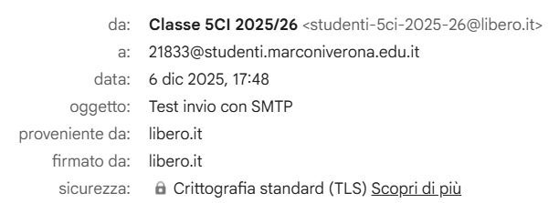

# Analisi di messaggi di posta inviati (SMTP) e ricevuti (POP3 e IMAP)

Per poter visualizzare i messaggi di posta e selezionare il protocollo desiderato ho usato il client di posta _Thunderbird_.
Per una maggiore libertà nell'utilizzo dei protocolli abbiamo utilizzando il servizio di posta di _libero_ creando un indirizzo email univoco per la classe (_studenti-5ci-2025-26@libero.it_).

Alla creazione di un nuovo account di posta elettronica nel client di posta _Thunderbird_ è possibile eseguire una configurazione manuale selezionando i protocolli e le specifiche.

I server per la ricezione della posta per i rispettivi protocolli sono:

- POP3: _popmail.libero.it_, porta 995, sicurezza SSL/TLS;
- IMAP: _imapmail.libero.it_, porta 993, sicurezza SSL/TLS;
- SMTP: _smtp.libero.it_, porta 465, sicurezza SSL/TLS, con autenticazione richiesta.

Utilizzando _Wireshark_ è possibile visualizzare un messaggio di posta inviato o ricevuto dal nostro client _Thunderbird_ filtrando secondo il protocollo utilizzato.

## Analisi dell'invio di un messaggio di posta con il protocollo SMTP

- Crittografia: nessuna
- Porta di destinazione: 25

Screenshot analisi _Wireshark_:

Screenshot email ricevuta e informazioni aggiuntive:

## Analisi ricezione di un messaggio di posta con POP3

Non è stato possibile analizzare i messaggi con _Wireshark_.

## Analisi ricezione di un messaggio di posta con IMAP

Non è stato possibile analizzare i messaggi con _Wireshark_.
