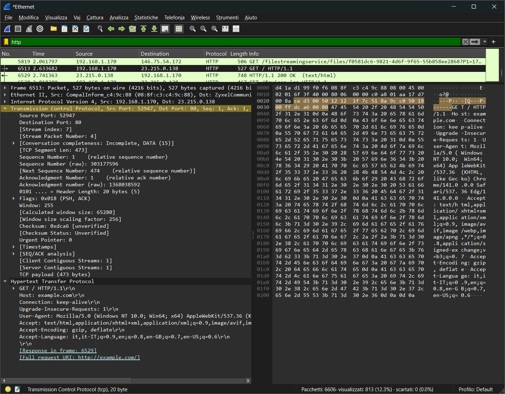

# Analisi di un messaggio HTTP con Wireshark e ricreazione di un server che risponda lo stesso pacchetto

## Analisi delle PDU con Wireshark

1. Aprire Wireshark, selezionare la scheda Ethernet del dispositivo e impostare come filtro "http";
2. Aprire un browser qualsiasi al link "http://example.com/";
3. Ora su wireshark appariranno le PDU scambiate tra la macchina e il server:

   - 
   - 

4. Copiare il contenuto html del pacchetto contenente la risposta HTTP "(text/html)" nelle info.

### Contenuto HTML del messaggio HTTP in arrivo dal server

```html
<!doctype html>
<html lang="en">
    <head>
        <title>Example Domain</title>
        <meta name="viewport" content="width=device-width, initial-scale=1">
        <style>
          body{
            background:#eee;
            width:60vw;
            margin:15vh auto;
            font-family:system-ui,sans-serif
          }
          h1{font-size:1.5em}
          div{opacity:0.8}
          a:link,a:visited{color:#348}
        </style>
    <body>
        <div>
            <h1>Example Domain</h1>
            <p>This domain is for use in documentation examples without needing permission. Avoid use in operations.
            <p><a href="https://iana.org/domains/example">Learn more</a>
        </div>
    </body>
</html>
```

### Note:

- La pagina HTML viene richiesta al server con una _HTTP GET request_ specificando come host "example.com".
- La risposta del server è una pagina HTML, inviata con HTTP e con status "OK" (200), il quale indica che la richiesta del client è stata ricevuta, compresa e processata correttamente dal server, e che il server ha restituito il contenuto richiesto.
- Su wireshark ho applicato il filtro "HTTP" per visualizzare solo i messaggi di quel tipo.
- Il payload si trova incapsulato nel messaggio HTTP, con wireshark si trova facilmente grazie alla sezione in basso a sinistra, la quale traduce e divide in sezioni la sequenza di bit ricevuta.

- Se la tastiera non dovesse essere sull'impostazione italiana una vilta avviato il server si deve procedere nel seguente modo:
  - aprire la configurazione guidata per cambiare la lingua della tastiera:
    > sudo dpkg-reconfigure keyboard-configuration
  - dopo la configurazione guidata riavviare il server per applicare le modifiche con:
    > sudo reboot

## Ricreazione di un server web che risponda come "example.com" (con http)

### Installazione di Apache sulla VM con Ubuntu Server:

1. Aggiornare la lista di pacchetti del sistema:
   > sudo apt update
2. Installare Apache:
   > sudo apt install apache2 -y
3. Assicurarsi che il server si sia già avviato da solo:
   > sudo systemctl status apache2
4. Assicurarsi che Apache si avvii sempre all'avvio della macchina:
   > sudo systemctl enable apache2
5. Configurare il firewall per permettere il traffico HTTP:
   > sudo ufw allow 'Apache'

Se non dovesse riconoscere ufw, installarlo con:

> sudo apt install ufw

Inoltre, assicurarsi che UFW (Uncomplicated Firewall) si avvii all'avvio della macchina:

> sudo systemctl enable ufw

Per leggere la documentazione di Apache:

- installare la documentazione:
  > sudo apt install apache2-doc
- includere il manuale nel file di configurazione:
  > sudo a2enconf apache2-doc
- riavviare Apache:
  > sudo systemctl reload apache2
- se non presente nel sistema, installare most (il visualizzatore di file più recente e completo) con:
  > sudo apt install most
- aprire il file contenente la documentazione con most (oppure andare a http://indirizzoServer/manual):
  > most /usr/share/doc/apache2/README.Debian.gz

(non esistono i file di documentazione - possibile interferenza con la modalità leggera)

Per accedere tramite ssh alla VM (per copiare con comodità del testo nel terminale):

- installare ssh:
  > sudo apt install openssh-server -y
- verificare che il servizio ssh si sia attivato automaticamente:
  > sudo systemctl status ssh
- assicurarsi che il servizio ssh parta all'avvio della macchina:
  > sudo systemctl enable ssh
- se UFW è abilitato (come mostrato in precedenza), permettere le connessioni ssh con:
  > sudo ufw allow ssh

### Modifica dell'index

Per modificare l'index - cioè la pagina che attualmente viene restituita quando si manda una GET all'indirizzo del server - procedere con:

> sudo nano /var/www/html/index.html

Una volta aperto il file, tenere premuto "Ctrl + K" per tagliare tutte le righe e poi rimpiazzarle con il proprio codice HTML dell'index.

### Osservare lo stato e le statistiche del server Apache:

Permettere la visualizzazione del file di stato ad una subnet:

> sudo nano /etc/apache2/mods-enabled/status.conf

Modificare il contenuto del tag "Location":

```Apache
<Location "/server-status">
    SetHandler server-status
    Require ip 192.168.1.0/24
</Location>
```

Riavviare Apache:

> sudo systemctl restart apache2

Visitare "http://[serverAddress]/server-status" nel browser.
