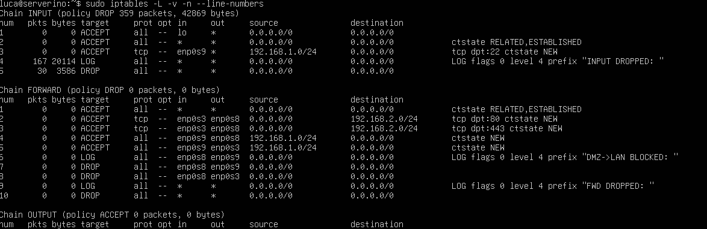

# Guida alla configurazione di una DMZ con iptables su Linux

## 1. Prerequisiti e topologia di rete

Prima di iniziare, è importante avere chiaro il disegno della rete. In questa guida utilizzeremo la seguente topologia:

| Interfaccia | IP              | Zona | Descrizione                        |
|-------------|-----------------|------|------------------------------------|
| `enp0s3`    | DHCP (WAN)      | WAN  | Connessione verso Internet         |
| `enp0s8`    | `192.168.2.1/24`| DMZ  | Rete dei server pubblici (web ecc) |
| `enp0s9`    | `192.168.1.1/24`| LAN  | Rete interna (workstation, utenti) |

**Politica di sicurezza applicata:**

- `Internet → DMZ`: permesso solo su porte specifiche (es. HTTP/HTTPS)
- `LAN → DMZ`: permesso (gli amministratori gestiscono i server)
- `LAN → Internet`: permesso con NAT (masquerade)
- `DMZ → LAN`: **vietato** — regola fondamentale della DMZ
- `DMZ → Internet`: **vietato** — i server non devono poter uscire liberamente

---

## 2. Installazione di iptables

Su sistemi Debian/Ubuntu, iptables è quasi sempre già presente. Verifichiamo:

```bash
iptables --version
```

Se non è installato, procediamo con:

```bash
# Aggiornamento dell'indice dei pacchetti
sudo apt update

# Installazione di iptables e del pacchetto per la persistenza delle regole
sudo apt install -y iptables iptables-persistent
```

> **Nota:** durante l'installazione di `iptables-persistent` verrà chiesto se salvare
> le regole attuali. Per ora rispondete **No** — le configureremo noi manualmente.

---

## 3. Aggiunta delle interfacce di rete su VirtualBox

Per avere tre interfacce di rete, la VM deve essere configurata con tre adattatori.
Eseguire questi passaggi con la **VM spenta**.

### Adattatore 1 — WAN (già esistente)

L'adattatore 1 (`enp0s3`) è già presente e configurato come **NAT** o **Bridged**.
Non serve modificarlo.

### Adattatore 2 — DMZ

1. Aprire **Impostazioni → Rete → Scheda 2**
2. Spuntare **"Abilita scheda di rete"**
3. Connessa a: **"Rete interna"**
4. Nome: `dmz-net`
5. Tipo scheda: Intel PRO/1000 MT Desktop
6. Cliccare **OK**

### Adattatore 3 — LAN

1. Aprire **Impostazioni → Rete → Scheda 3**
2. Spuntare **"Abilita scheda di rete"**
3. Connessa a: **"Rete interna"**
4. Nome: `lan-net`
5. Tipo scheda: Intel PRO/1000 MT Desktop
6. Cliccare **OK**

Avviare la VM. Le nuove interfacce appariranno come `enp0s8` e `enp0s9` (i nomi
esatti possono variare — verificare con `ip link show`).

---

## 4. Assegnazione degli indirizzi IP alle interfacce

### Assegnazione temporanea (attiva fino al riavvio)

```bash
# Assegna IP all'interfaccia DMZ e la attiva
sudo ip addr add 192.168.2.1/24 dev enp0s8
sudo ip link set enp0s8 up

# Assegna IP all'interfaccia LAN e la attiva
sudo ip addr add 192.168.1.1/24 dev enp0s9
sudo ip link set enp0s9 up
```

### Assegnazione permanente con Netplan (Debian/Ubuntu moderno)

Aprire il file di configurazione Netplan:

```bash
sudo nano /etc/netplan/01-netcfg.yaml
```

Configurarlo come segue:

```yaml
network:
  version: 2
  ethernets:

    enp0s3:
      dhcp4: true          # WAN — ottiene IP dal router/modem

    enp0s8:
      dhcp4: no
      addresses:
        - 192.168.2.1/24   # Gateway della DMZ

    enp0s9:
      dhcp4: no
      addresses:
        - 192.168.1.1/24   # Gateway della LAN
```

Applicare la configurazione:

```bash
sudo netplan apply
```

Verificare che tutto sia corretto:

```bash
ip addr show
```

Dovreste vedere tutte e tre le interfacce con stato **UP** e i rispettivi indirizzi IP.

---

## 5. Abilitazione del forwarding IP

Il forwarding IP permette al kernel Linux di instradare pacchetti tra le interfacce,
trasformando la macchina in un router. Senza questa impostazione, iptables non può
fare forwarding anche se le regole lo permettono.

### Attivazione immediata (temporanea)

```bash
echo 1 > /proc/sys/net/ipv4/ip_forward
```

### Attivazione permanente (sopravvive al riavvio)

```bash
# Aprire il file di configurazione del kernel
sudo nano /etc/sysctl.conf
```

Cercare e decommentare (o aggiungere) la seguente riga:

```
net.ipv4.ip_forward = 1
```

Applicare subito senza riavviare:

```bash
sudo sysctl -p
```

Verificare che sia attivo:

```bash
cat /proc/sys/net/ipv4/ip_forward
# Output atteso: 1
```

---

## 6. Reset delle regole iptables

Prima di applicare nuove regole è buona pratica partire da uno stato pulito.
**Importante:** impostare le policy su ACCEPT *prima* di fare il flush, per evitare
di bloccare la propria sessione SSH durante le operazioni.

```bash
# Prima di tutto: policy permissive su tutte le chain
# (evita di bloccarsi fuori durante il reset)
sudo iptables -P INPUT   ACCEPT
sudo iptables -P FORWARD ACCEPT
sudo iptables -P OUTPUT  ACCEPT

# Svuota tutte le regole della tabella filter
sudo iptables -F

# Elimina le chain definite dall'utente
sudo iptables -X

# Svuota le tabelle NAT e mangle
sudo iptables -t nat    -F
sudo iptables -t nat    -X
sudo iptables -t mangle -F
sudo iptables -t mangle -X
sudo iptables -t raw    -F
sudo iptables -t raw    -X
```

---

## 7. Creazione della DMZ con iptables

Di seguito il ruleset completo, suddiviso per sezioni con commenti esplicativi.
Si consiglia di salvarlo come script bash ed eseguirlo tutto insieme.

```bash
#!/bin/bash
# =================================================================
# Configurazione DMZ con iptables
# Firewall: 192.168.1.200
# enp0s3 = WAN | enp0s8 = DMZ (192.168.2.0/24) | enp0s9 = LAN (192.168.1.0/24)
# =================================================================


# -----------------------------------------------------------------
# SEZIONE 1 — Abilitazione forwarding IP
# Necessario per instradare pacchetti tra le interfacce
# -----------------------------------------------------------------
echo 1 > /proc/sys/net/ipv4/ip_forward


# -----------------------------------------------------------------
# SEZIONE 2 — Reset a stato pulito
# Si parte sempre da zero per evitare conflitti con regole precedenti
# -----------------------------------------------------------------
iptables -P INPUT   ACCEPT
iptables -P FORWARD ACCEPT
iptables -P OUTPUT  ACCEPT
iptables -F
iptables -X
iptables -t nat    -F
iptables -t mangle -F


# -----------------------------------------------------------------
# SEZIONE 3 — Policy di default: nega tutto il traffico in ingresso
# Tutto ciò che non è esplicitamente permesso viene bloccato.
# OUTPUT rimane ACCEPT: il firewall stesso può comunicare liberamente.
# -----------------------------------------------------------------
iptables -P INPUT   DROP
iptables -P FORWARD DROP
iptables -P OUTPUT  ACCEPT


# -----------------------------------------------------------------
# SEZIONE 4 — Loopback
# Il traffico locale (127.0.0.1) deve sempre essere permesso,
# altrimenti molti servizi di sistema smettono di funzionare.
# -----------------------------------------------------------------
iptables -A INPUT -i lo -j ACCEPT


# -----------------------------------------------------------------
# SEZIONE 5 — Traffico già stabilito o correlato
# Permette il traffico di ritorno per connessioni già aperte.
# Senza questa regola, anche le risposte ai pacchetti permessi
# verrebbero bloccate.
# -----------------------------------------------------------------
iptables -A INPUT   -m conntrack --ctstate ESTABLISHED,RELATED -j ACCEPT
iptables -A FORWARD -m conntrack --ctstate ESTABLISHED,RELATED -j ACCEPT


# -----------------------------------------------------------------
# SEZIONE 6 — SSH al firewall stesso (solo dalla LAN)
# L'accesso amministrativo SSH è consentito solo dalla rete interna.
# Non esporre mai SSH su Internet.
# -----------------------------------------------------------------
iptables -A INPUT -i enp0s9 -p tcp --dport 22 \
  -s 192.168.1.0/24 -m conntrack --ctstate NEW -j ACCEPT


# -----------------------------------------------------------------
# SEZIONE 7 — Internet → DMZ: permetti HTTP e HTTPS
# Solo il traffico web è ammesso dall'esterno verso la DMZ.
# Sarebbe meglio specificare l'IP di destinazione per limitare
# la superficie di attacco al solo server web.
# -----------------------------------------------------------------
iptables -A FORWARD -i enp0s3 -o enp0s8 \
  -d 192.168.2.0/24 -p tcp --dport 80 \
  -m conntrack --ctstate NEW -j ACCEPT

iptables -A FORWARD -i enp0s3 -o enp0s8 \
  -d 192.168.2.0/24 -p tcp --dport 443 \
  -m conntrack --ctstate NEW -j ACCEPT


# -----------------------------------------------------------------
# SEZIONE 8 — LAN → DMZ: accesso completo
# Gli amministratori nella LAN possono gestire i server in DMZ
# (SSH, pannelli di controllo, deploy, ecc.)
# -----------------------------------------------------------------
iptables -A FORWARD -i enp0s9 -o enp0s8 \
  -s 192.168.1.0/24 -m conntrack --ctstate NEW -j ACCEPT


# -----------------------------------------------------------------
# SEZIONE 9 — LAN → Internet: permetti con NAT
# Le macchine della LAN possono navigare su Internet.
# -----------------------------------------------------------------
iptables -A FORWARD -i enp0s9 -o enp0s3 \
  -s 192.168.1.0/24 -m conntrack --ctstate NEW -j ACCEPT

# -----------------------------------------------------------------
# SEZIONE 10 — DMZ → LAN: VIETATO (regola fondamentale)
# Se un server in DMZ viene compromesso, l'attaccante non deve
# poter raggiungere la rete interna. Questa regola è il cuore
# della DMZ: isola la zona pubblica da quella privata.
# Il LOG permette di rilevare tentativi di intrusione.
# -----------------------------------------------------------------
iptables -A FORWARD -i enp0s8 -o enp0s9 \
  -j LOG --log-prefix "DMZ->LAN BLOCCATO: " --log-level 4

iptables -A FORWARD -i enp0s8 -o enp0s9 -j DROP


# -----------------------------------------------------------------
# SEZIONE 11 — DMZ → Internet: VIETATO
# I server in DMZ non devono poter uscire liberamente su Internet.
# Questo impedisce, ad esempio, che un server compromesso scarichi
# malware o si connetta a server di comando e controllo.
# -----------------------------------------------------------------
iptables -A FORWARD -i enp0s8 -o enp0s3 -j DROP


# -----------------------------------------------------------------
# SEZIONE 12 — Log e drop finale
# Tutto il traffico non esplicitamente permesso viene registrato
# e scartato. I log sono preziosi per il debugging e per rilevare
# tentativi di accesso non autorizzati.
# -----------------------------------------------------------------
iptables -A INPUT   -j LOG --log-prefix "INPUT BLOCCATO: "   --log-level 4
iptables -A FORWARD -j LOG --log-prefix "FORWARD BLOCCATO: " --log-level 4
iptables -A INPUT   -j DROP
iptables -A FORWARD -j DROP

echo "Regole DMZ applicate con successo."
```

---

## 8. Salvataggio delle regole

Le regole iptables sono volatili: vengono perse al riavvio se non salvate.

### Eseguire lo script e salvare

```bash
# Rendere lo script eseguibile
chmod +x dmz-rules.sh

# Eseguirlo con i permessi di root
sudo ./dmz-rules.sh

# Salvare le regole in modo persistente
sudo netfilter-persistent save
```

I file vengono salvati in:
- `/etc/iptables/rules.v4` — regole IPv4
- `/etc/iptables/rules.v6` — regole IPv6

Al prossimo avvio, il servizio `netfilter-persistent` le ricaricherà automaticamente.

### Su RHEL / CentOS / Rocky Linux

```bash
sudo service iptables save
# oppure
sudo iptables-save > /etc/sysconfig/iptables
```

---

## 9. Verifica e monitoraggio

### Visualizzare le regole attive

```bash
# Mostra tutte le chain con contatori di pacchetti e byte
sudo iptables -L -v -n --line-numbers
```
Output:


### Verificare le interfacce e gli IP

```bash
ip addr show
ip route show
```

### Monitorare i log in tempo reale

```bash
# Tutti i blocchi DMZ → LAN
sudo journalctl -f | grep "DMZ->LAN BLOCCATO"

# Tutti i blocchi in ingresso
sudo journalctl -f | grep "INPUT BLOCCATO"

# Tutto il traffico bloccato
sudo journalctl -f | grep "BLOCCATO"
```