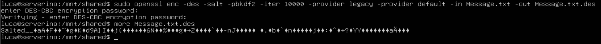

# Setup di un server Linux su VirtualBox per crittografare con diversi algoritmi di OpenSSL

## Installazione e configurazione del server FTP

### Installazione

Per installare il server:

```shell
sudo apt install vsftpd
```

### Configurazione

How to Use a Shared Folder in VirtualBox with Minimal Ubuntu Server

1. Prepare VirtualBox on the Host
   Before touching Ubuntu Server, configure the shared folder:

Open VirtualBox Manager → select your VM → Settings → Shared Folders.

Add a new shared folder:

Folder Path: choose a folder on your host.

Folder Name: e.g., shared.

Enable Auto-mount (optional).

Enable Make Permanent.

This only declares the shared folder; Ubuntu still needs Guest Additions to access it.

2. Install Required Packages in Ubuntu Server
   Minimal Ubuntu Server lacks build tools, so install them:

bash
sudo apt update
sudo apt install build-essential dkms linux-headers-$(uname -r)
These are required to compile the Guest Additions kernel modules.

3. Install VirtualBox Guest Additions
   Guest Additions enable shared folders, clipboard sync, and other integration features.

In VirtualBox menu: Devices → Insert Guest Additions CD image.

Mount the CD:

bash
sudo mount /dev/cdrom /mnt
Run the installer:

bash
cd /mnt
sudo ./VBoxLinuxAdditions.run
Reboot:

bash
sudo reboot 4. Create a Mount Point in Ubuntu Server
Choose where the shared folder will appear:

bash
sudo mkdir /mnt/shared 5. Manually Mount the Shared Folder
Use the folder name you set in VirtualBox (e.g., shared):

bash
sudo mount -t vboxsf shared /mnt/shared
Now /mnt/shared contains the files from your host folder.

6. (Optional) Auto-Mount on Boot
   Add this line to /etc/fstab:

bash
shared /mnt/shared vboxsf defaults 0 0
This ensures the folder mounts automatically after each reboot.

### Crittazione con DES:


