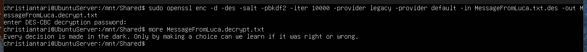

# Setup di un server Linux su VirtualBox per crittografare con diversi algoritmi di OpenSSL

## Setup di una cartella condivisa tra VM e macchina fisica

Per poter eseguire l'es. 1 senza dover copiare manualmente il file crittato, useremo una cartella condivisa tra la VM e la macchina virtuale che la ospita.

### Configurazione

1. Prepare VirtualBox on the Host
   Before touching Ubuntu Server, configure the shared folder:

Open VirtualBox Manager → select your VM → Settings → Shared Folders.

Add a new shared folder:

Folder Path: choose a folder on your host.

Folder Name: e.g., shared.

Enable Auto-mount (optional).

Enable Make Permanent.

This only declares the shared folder; Ubuntu still needs Guest Additions to access it.

2. Install Required Packages in Ubuntu Server

- Minimal Ubuntu Server lacks build tools, so install them:

```bash
sudo apt update
sudo apt install build-essential dkms linux-headers-$(uname -r)
```

These are required to compile the Guest Additions kernel modules.

3. Install VirtualBox Guest Additions

- Guest Additions enable shared folders, clipboard sync, and other integration features.

> In VirtualBox menu: Devices → Insert Guest Additions CD image.

- Mount the CD:

```bash
sudo mount /dev/cdrom /mnt
```

- Run the installer:

```bash
cd /mnt
sudo ./VBoxLinuxAdditions.run
```

- Reboot:

```bash
sudo reboot
```

4. Create a Mount Point in Ubuntu Server

- Choose where the shared folder will appear:

```bash
sudo mkdir /mnt/shared
```

5. Manually Mount the Shared Folder

- Use the folder name you set in VirtualBox (e.g., shared):

```bash
sudo mount -t vboxsf shared /mnt/shared
```

Now /mnt/shared contains the files from your host folder.

6. (Optional) Auto-Mount on Boot

- Add this line to /etc/fstab:

```bash
shared /mnt/shared vboxsf defaults 0 0
```

This ensures the folder mounts automatically after each reboot.

## Setup e utilizzo suite OpenSSL per criptare

1. crea un messaggio msg.txt con un editor di testo di contenuto a piacere (legale e morale ;-);

2a) cifra con DES il messaggio; invia una mail con nel testo la password a un tuo compagno e in allegato il messaggio cifrato;


> sudo openssl enc -d -des -salt -pbkdf2 -iter 10000 -provider legacy -provider default -in Messaggio.txt.des -out Message.decrypt.txt

2b) decifra il messaggio ricevuto via e-mail dal compagno;


> sudo openssl enc -des -salt -pbkdf2 -iter 10000 -provider legacy -provider default -in Messaggio.txt -out Messaggio.txt.des

3. effettua cifratura e decifratura di un messaggio con 3DES

Cifratura:

> openssl enc -des-ede3-cbc -salt -pbkdf2 -iter 10000 -in Message.txt -out Message.txt.des3

Decifratura:

> openssl enc -d -des-ede3-cbc -salt -pbkdf2 -iter 10000 -in Message.txt.des3 -out Message.decrypt.txt

4. effettua cifratura e decifratura di un essaggio con AES

Cifratura:

> openssl enc -aes-256-cbc -a -salt -in Message.txt -out Message.txt.aes

Decifratura:

> openssl enc -aes-256-cbc -a -d -in Message.txt.aes -out Message.decrypt.txt

===

Scarica la Divina Commedia di Dante Alighieri in txt (https://dmf.unicatt.it/~della/pythoncourse18/commedia.txt)

Comando per scaricare dal web da riga di comando:

> wget -o newFileName.txt http://urlToResource.txt

Per verificare lo stato del download usa:

> wget -c https://urlToResource.txt

1. Usando openssl crea il suo hash utilizzando

1a) checksum

```bash
sum commedia.txt > CHECKSUM/commedia.txt.sum
# output: 47436   545 commedia.txt
```

1b) CRC

```bash
cksum commedia.txt > CRC/commedia.txt.crc
# output: 1956078826 557962 commedia.txt
```

1c) MD5

```bash
openssl dgst -md5 commedia.txt > MD5/commedia.txt.md5
# output: MD5(commedia.txt)= 48bc1c6ee762f2d06111f821825cc941
```

1d) SHA-1

```bash
openssl dgst -sha1 commedia.txt > SHA1/commedia.txt.sha1
# output: SHA1(commedia.txt)= 1016d196e27c200b4b028f2922fd06b3691bc193
```

1e) SHA-256

```bash
openssl dgst -sha256 commedia.txt > SHA256/commedia.txt.sha256
# output: SHA2-256(commedia.txt)= 5a951c8e4d180915fb47a297012c81463c3613b3f21893da4f3f40aa14f71904
```

1f) SHA-512

```bash
openssl dgst -sha512 commedia.txt > SHA512/commedia.txt.sha512
# output: SHA2-512(../commedia.txt)= c6e58382c887b066ed23a1215ed57e2e37b3b309d2a9196dc00cc1a68c9ce514e2670e65fadb18603372bbdc9bc3702880cde7579bcfd39257f89759f3f4073a
```
