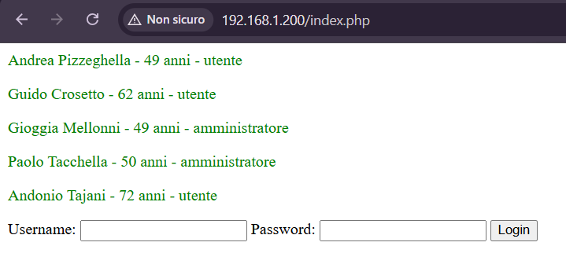

## DataBase

### Installazione del DBMS (MySQL) e di PHP
[Fonte](https://dev.to/idboussadel/setting-up-an-apache-server-with-php-and-ssh-on-linux-2d2)
```bash
# Updating and upgrading apt
sudo apt update && sudo apt upgrade -y
# Installing Apache (web server), MySql server (RDBMS), PHP, an Apache module to enable PHP processing, a PHP extension to allow PHP to communicate with MySQL
sudo apt install apache2 mysql-server php libapache2-mod-php php-mysql -y

# Starting Apache and MySql and making sure they start at boot
sudo systemctl start apache2
sudo systemctl enable apache2
sudo systemctl start mysql
sudo systemctl enable mysql

# Run the MySQL security script to secure your database:
# - Set a root password
# - Remove anonymous users
# - Disallow remote root login
# - Remove test databases
# - Reload privilege tables
sudo mysql_secure_installation

# Then, log in to MySQL and create a database:
sudo mysql -u root -p

# ------------- INSIDE MySQL: -------------
# Creates a new database named IdleDB
CREATE DATABASE IdleDB;
# Creates a new MySQL user myuser with the password mypassword.
# The @'%' part allows the user to connect from any host (% is a wildcard representing any IP address).
CREATE USER 'luca'@'localhost' IDENTIFIED WITH mysql_native_password BY '123456789';
GRANT ALL PRIVILEGES ON IdleDB.* TO 'luca'@'localhost';

# Refreshes the MySQL server's internal cache of user privileges. This is necessary after creating users or changing privileges to apply the changes.
FLUSH PRIVILEGES;

# Insert the data in the table from a file (you can do this now or later)
SOURCE /path/to/your/file.sql;

EXIT;
# ------------- MySQL CLOSED -------------

# Configure Apache to Serve Your PHP Site
# Remove all contents of the Apache /var/www/html folder
sudo rm -rf /var/www/html/*
# Create a new php file (or copy here the file if you already have it)
sudo nano /var/www/html/index.php
# (Save and exit)

# Set proper permissions:
# Change ownership of all files and directories in /var/www/html recursively
sudo chown -R www-data:www-data /var/www/html
# The user and group ownership is set to 'www-data' which is the default user/group for web servers (Nginx/Apache)

# - Owner (www-data) has read, write, and execute permissions (7)
# - Group (www-data) and Others have read and execute permissions, but no write permissions
sudo chmod -R 755 /var/www/html

# Restart Apache:
sudo systemctl restart apache2
```

### Creazione di un DataBase con una tabella con i seguenti campi: NomeUtente, Password, Nome, Cognome, eta, funzione
(Si consideri come funzione: utente, amministratore)
```sql
CREATE DATABASE IdleDB;

CREATE TABLE Utenti(
    nomeUtente varchar(32) PRIMARY KEY,
    password varchar(32) NOT NULL,
    nome varchar(64) NOT NULL,
    cognome varchar(64) NOT NULL,
    eta int NOT NULL,
    funzione ENUM('utente', 'amministratore'),
);
```

### Popolazione del DataBase con 5 record a scelta
(Ogni riferimento a qualsiasi persona reale è puramente casuale e da _non_ considerarsi intenzionale)
```sql
INSERT INTO Utenti(nomeUtente, password, nome, cognome, eta, funzione) VALUES
    ('paoloTack', 'Sistemi4Ever!!!', 'Paolo', 'Tacchella', 50, 'amministratore'),
    ('gioggiaM', 'SonoUnaDonna99', 'Gioggia', 'Mellonni', 49, 'amministratore'),
    ('tajuzAndo', '_ValeFinoAUnCertoPunto_', 'Andonio', 'Tajani', 72, 'utente'),
    ('crostetto', 'Poveri77Frustrati', 'Guido', 'Crosetto', 62, 'utente'),
    ('andrePizzi', 'METEOMETEOMETEO', 'Andrea', 'Pizzeghella', 49, 'utente');
```

## PHP e HTML
### Creare una pagina web con campi di input username, password che fornisca come output Nome, Cognome, Eta, Funzione
Pagina HTML racchiusa in uno script PHP:
```php
<!-- Codice PHP principale -->
<?php
    if ($_SERVER["REQUEST_METHOD"] == "POST"){
        # Inizializzazione delle variabili descrittive della connessione con il DB
        $servername = "localhost";
        $username = "luca";
        $password = "METTI QUI LA PASSWORD!!!";
        $dbname = "IdleDB";

        # Create connection
        $conn = new mysqli($servername, $username, $password, $dbname);
        // Check connection
        if ($conn->connect_error) {
            die("Connection to DB failed: " . $conn->connect_error);
        }

        $user = $_POST["uuser"];
        $pass = $_POST["upsw"];

        # Prepare SQL and retrieve data
        $sql = "SELECT nome, cognome, eta, funzione 
        FROM Utenti 
        WHERE nomeUtente = '$user' AND password = '$pass'";

        $result = $conn->query($sql);

        if ($result->num_rows > 0) {
            while ($row = $result->fetch_assoc()) {
                echo "<p class='result'>{$row['nome']} {$row['cognome']} - {$row['eta']} anni - {$row['funzione']}</p>";
            }
        } else {
            echo "<p class='error'>Nessun risultato</p>";
        }

        $conn->close();
    }
?>

<!-- Pagina HTML con PHP embedded -->
<!DOCTYPE html>
<html>
    <head>
        <title>Per piacere non fate una SQL Injection qui</title>
        <style>
        .error {color: red;}
        .result {color: green;}
        </style>
    </head>
    <body>
        <form action="<?php echo htmlspecialchars($_SERVER['PHP_SELF']); ?>" method='POST' target='_self'>
            <label for='uuser'>Username:</label>
            <input type='text' id='uuser' name='uuser'>

            <label for='upsw'>Password:</label>
            <input type='password' id='upsw' name='upsw'>

            <input type='submit' value='Login'/>
        </form>
    </body>
</html>
```

### Generare una stringa SQL che, opportunamente inserita, faccia fornire, noto solo un username, la lista di username e password, cognome e funzione

Digitando come username e come password la stringa "' OR '1'='1", si esegue una SQL Injection, permettendo la visualizzazione di tutti i dati di tutti gli utenti:
