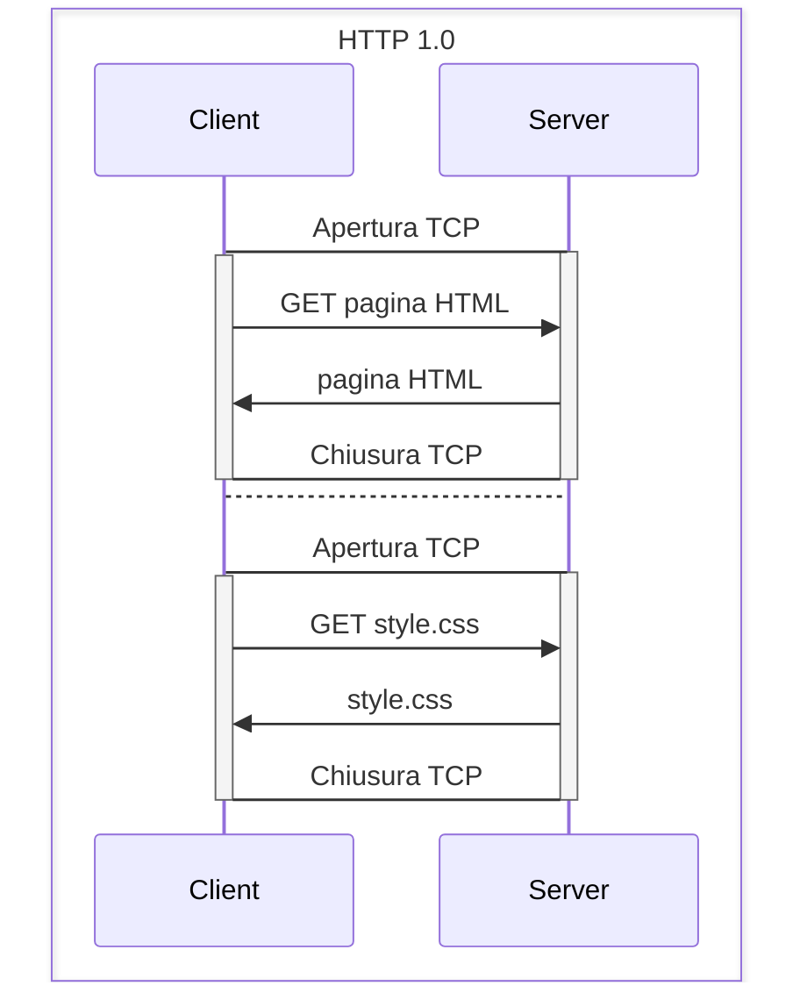
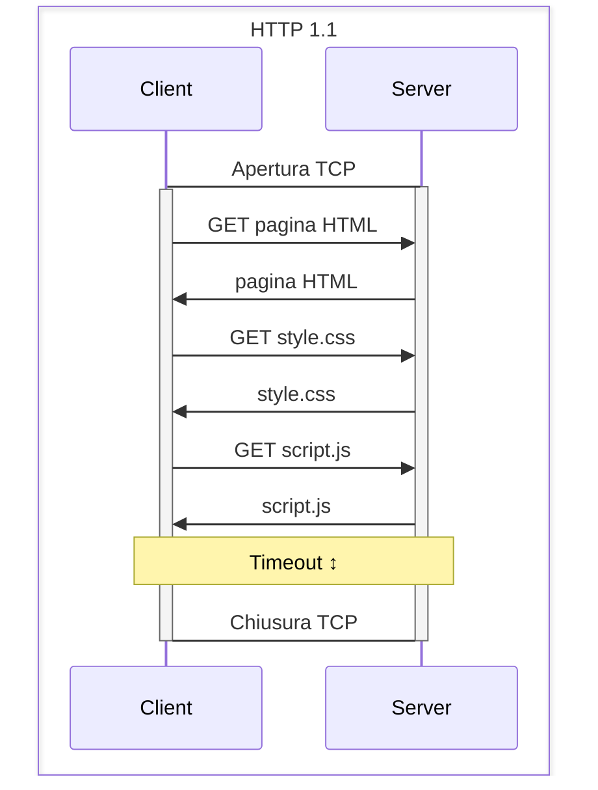
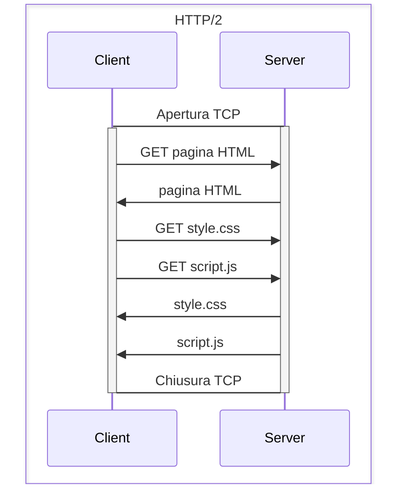

La versione 1.0 di HTTP (_stateless_) prevedeva che ci potesse essere al massimo la richiesta di un oggetto per connessione, quindi per n elementi della pagina (la pagina, lo stile, lo script, e le immagini) venivano fatte n chiamate HTTP separate indipendenti l'una dall'altra.

Esempio:

**HTTP 1.1** prevede invece la possibilità di connessioni persistenti: in questo modo più richieste possono essere spedite su una singola connessione TPC, riducendo così il tempo di accesso alle risorse.

Esempio:

**HTTP/2** cerca di parallelizzare le operazioni attraverso nuove funzionalità. La compressione delle intestazioni, il multiplexing di richieste e risposte per ricevere più risorse in un'unica sessione e la priorità delle richieste push riducono sul server i tempi di elaborazione delle richieste che pervengono dal client. Tutto questo si traduce in una maggior velocità nella ricezione delle pagine Web.

Esempio:
